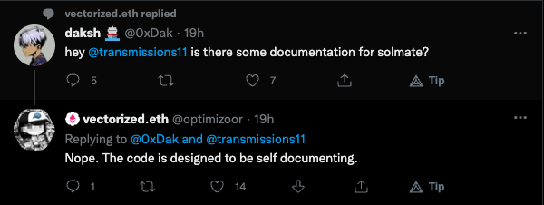

# About `solmate`

## History

- Written by [t11s](https://xn--2-kmb.com/)
    - Famous for low-level gas optimizations & data-driven Solidity engineering
- Started as a project inside of RariCapital
- Then moved to t11s' private repo after they switched to Paradigm


## Disclaimer about Security

Copied from README:
```markdown
[...] these contracts are **not designed with user safety** in mind:

- There are implicit invariants these contracts expect to hold.
- **You can easily shoot yourself in the foot if you're not careful.**
- You should thoroughly read each contract you plan to use top to bottom.
```

Also:



### Auditing Projects using `solmate`:

While `solmate` itself can be assumed to be secure (if using major version), the
contracts used should be studied carefully anyway in order to check that the
project uses them correctly.


## Philosophical Differences to `OpenZeppelin`

`OpenZeppelin`:
- Want to make it as hard as possible to misuse the contracts
    - Said by [Nicolas Venturo](https://twitter.com/mrnventuro) in the [Devs Do Something](https://www.devsdosomething.fm/episodes/nicolas-venturo-solidity-engineering-at-balancer-labs-the-dangers-of-gas-golfing) podcast
- -> Useful for every Solidity developer

`solmate`:
- Optimizes as much as possible for the **average** case
    - -> Misses checks for corner cases
- Highly opinionated
- -> Should only be used by experienced Solditiy developers

### Personal Note

IMHO `solmate` does a really good job of not reinventing the wheel but instead
getting inspired from a ton of high quality and battle-proved projects.


## What's inside?

```ml
   auth
   ├─ Owned — "Simple single owner authorization"
-> ├─ Auth — "Flexible and updatable auth pattern"
   ├─ authorities
   │  ├─ RolesAuthority — "Role based Authority that supports up to 256 roles"
   │  ├─ MultiRolesAuthority — "Flexible and target agnostic role based Authority"
   mixins
   ├─ ERC4626 — "Minimal ERC4626 tokenized Vault implementation"
   tokens
   ├─ WETH — "Minimalist and modern Wrapped Ether implementation"
-> ├─ ERC20 — "Modern and gas efficient ERC20 + EIP-2612 implementation"
-> ├─ ERC721 — "Modern, minimalist, and gas efficient ERC721 implementation"
   ├─ ERC1155 — "Minimalist and gas efficient standard ERC1155 implementation"
   utils
   ├─ SSTORE2 — "Library for cheaper reads and writes to persistent storage"
   ├─ CREATE3 — "Deploy to deterministic addresses without an initcode factor"
   ├─ LibString — "Library for creating string representations of uint values"
   ├─ SafeCastLib — "Safe unsigned integer casting lib that reverts on overflow"
   ├─ SignedWadMath — "Signed integer 18 decimal fixed point arithmetic library"
   ├─ MerkleProofLib — "Efficient merkle tree inclusion proof verification library"
-> ├─ ReentrancyGuard — "Gas optimized reentrancy protection for smart contracts"
   ├─ FixedPointMathLib — "Arithmetic library with operations for fixed-point numbers"
   ├─ Bytes32AddressLib — "Library for converting between addresses and bytes32 values"
-> ├─ SafeTransferLib — "Safe ERC20/ETH transfer lib that handles missing return values"
```

## Comparison of Documentation: `solmate` vs `OpenZeppelin`

See [solmate's ReentrancyGuard](./solmate/src/utils/ReentrancyGuard.sol) vs [OpenZeppelin's ReentrancyGuard](./openzeppelin-contracts/contracts/security/ReentrancyGuard.sol).

`OpenZeppelin`:

Provides a lot of in-code documentation explaining the
reasoning behind decisions (e.g. why are the lock's values `1` and `2`
instead of `0` and `1`?).

`solmate`:

Links to the OZ repo :)

## `auth/Auth.sol`

Check comments in code: [Auth](./solmate/src/auth/Auth.sol)

**Problem**:

If the `Authorizer` instance is compromised, the whole `Auth` system is
compromised because it can make `canCall()` calls always fail (e.g. by using
all available gas).

Even the owner can not change the `Authority` anymore!

## `tokens/ERC20.sol` & `tokens/ERC721.sol`

Check comments inside the code:
- [solmate's ERC20](./solmate/src/tokens/ERC20.sol)
- [solmate's MockERC20](./solmate/src/test/utils/mocks/MockERC20.sol)
- [OpenZeppelin's ERC20](./openzeppelin-contracts/contracts/token/ERC20/ERC20.sol)
- [solmate's ERC721](./solmate/src/tokens/ERC721.sol)
- [OpenZeppelin's ERC721](./openzeppelin-contracts/contracts/token/ERC721/ERC721.sol)

**Problem**:

Invariant is not enforced in order to save gas and give downstream contracts,
i.e. user/developers, more power over internal state.

Remember: with great power comes great responsibility 🕷

## `utils/SafeTransferLib` or: How I learned to stop worrying and love assembly 💣

Check comments inside the code:
- [solmate's SafeTransferLib](./solmate/src/utils/SafeTransferLib.sol)
- [OpenZeppelin's SafeERC20](./openzeppelin-contracts/contracts/token/ERC20/utils/SafeERC20.sol)
- [OpenZeppelin's Address](./openzeppelin-contracts/contracts/utils/Address.sol)
